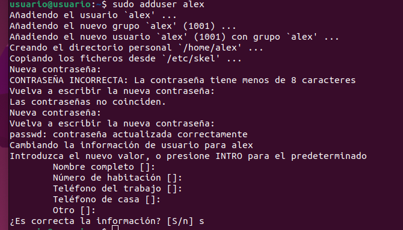
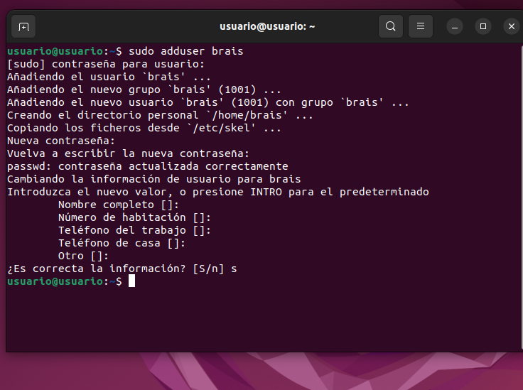
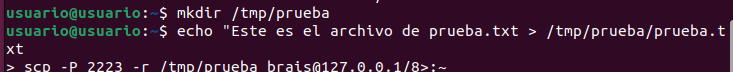
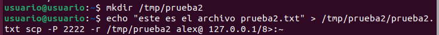
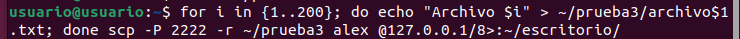

# Trabajo Tareas FH - Alejandro Castro Rivero

## 1. Creación de máquinas virtuales

Primero creamos las dos máquinas virtuales de Ubuntu y les cambiamos los puertos y los redireccionamos.

## 2. Creación de usuarios

- En la **máquina A** creamos el usuario `Alex`.



- En la **máquina B** creamos el usuario `Brais`.



## 3. Conexión entre máquinas

Ahora nos conectamos desde A a B.


En A hacemos lo mismo:



Y en B igual:



## 4. Transferencia de directorios

Ahora transmitimos directorios al escritorio.


## 5. Prueba de carga de archivos

Ahora creamos **prueba 3** con 200 archivos.


## 6. Generación de clave SSH

Creamos la clave SSH y nos conectamos con **passphrase**.



## 7. Conexión con clave SSH

Después nos conectamos con este comando y listo:

```bash
ssh usuario@ip -p puerto
```
